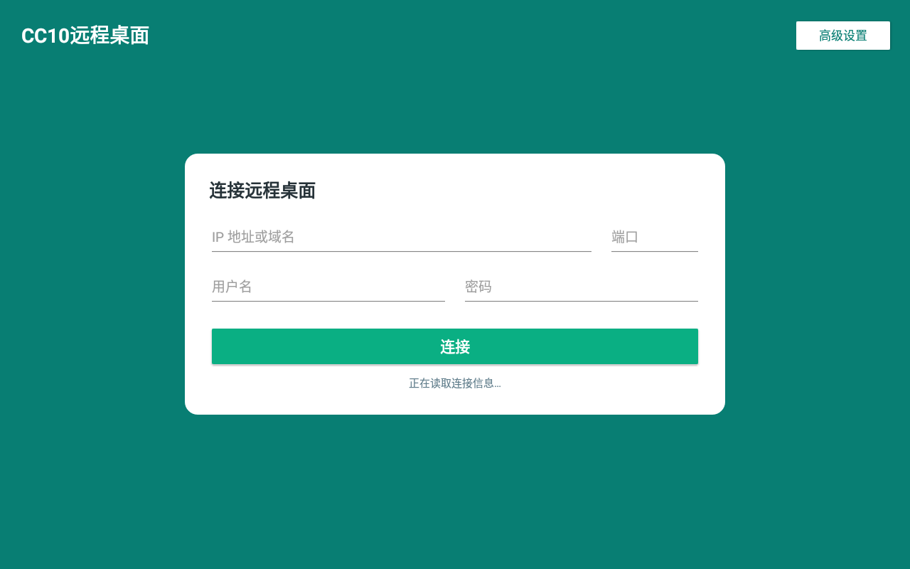

# CC10 远程桌面

面向天猫精灵 CC10（TG_Z04、Android 8.1、ARMv7、1280×800）的轻量 RDP 客户端，基于 [FreeRDP](https://github.com/FreeRDP/FreeRDP) Android 客户端定制。

## 界面预览



## 已实现功能

- 适配 CC10 1280×800 横屏，连接后请求同尺寸远程桌面。
- 首页直接填写 IP/域名、端口、用户名和密码，无多账户列表。
- 高级设置收纳低频参数。
- 单指点击、按住拖动、窗口拖动和滑块拖动。
- 可拖动并记忆位置的边缘工具栏。
- 工具栏支持键盘、鼠标模式、麦克风和断开连接。
- 工具栏可折叠到屏幕边缘，再次点击恢复。
- Microsoft Remote Desktop 风格应用图标。

## 直接安装

已编译并通过 CC10 实机验证的 APK：

[`release/CC10-RDP-v5-MicrosoftIcon.apk`](release/CC10-RDP-v5-MicrosoftIcon.apk)

```powershell
adb install -r release/CC10-RDP-v5-MicrosoftIcon.apk
```

APK SHA-256：

```text
3fd38a404ef593735385cd098a2e53950909ba6884a788b98413f78838e538e6
```

## 源码结构

本仓库只保存 CC10 定制内容，不重复托管完整 FreeRDP 上游源码：

```text
patches/cc10-android.patch    对上游已跟踪文件的修改
overlay/                     CC10 新增源码、布局、图标和构建辅助文件
scripts/Apply-CC10Patch.ps1  自动应用补丁与覆盖文件
docs/images/                 README 截图
release/                     可直接安装的 APK
```

对应的 FreeRDP 上游基线：

```text
commit 69afd13014b3a5f5e32d649112ce6f06d8024449
```

## 还原完整源码

```powershell
git clone https://github.com/FreeRDP/FreeRDP.git freerdp-cc10
cd freerdp-cc10
git checkout 69afd13014b3a5f5e32d649112ce6f06d8024449
powershell -ExecutionPolicy Bypass -File ..\cc10-remote-desktop\scripts\Apply-CC10Patch.ps1 -FreeRdpRoot .
```

## 构建环境

- Windows 10
- Android SDK 与 NDK
- JDK（与所用 Android Gradle Plugin 匹配）
- CMake、Ninja
- Git for Windows（提供 `sh`/Perl 时可复用）
- MinGW `mingw32-make`

Windows 下编译 OpenSSL 时，可通过环境变量指定工具：

```powershell
$env:PERL_EXE = "D:\Git\usr\bin\perl.exe"
$env:MAKE_EXE = "D:\MinGW\bin\mingw32-make.exe"
$env:SH_EXE = "D:\Git\usr\bin\sh.exe"
```

然后把 `overlay/tool-bin` 中的辅助脚本复制到 FreeRDP 根目录的 `tool-bin`（自动应用脚本会完成此操作），再按 FreeRDP Android 构建流程编译 `aFreeRDP`。

## 安全说明

- 仓库不包含保存的 RDP 主机、用户名、密码或连接数据库。
- 不包含 `local.properties`、签名文件、密钥、构建缓存和测试日志。
- 建议仅通过可信局域网、VPN 或安全网关使用 RDP，不要直接将 RDP 端口暴露到公网。

## 许可证

本项目是 FreeRDP 的设备适配修改，沿用上游 Apache License 2.0。FreeRDP 名称及相关权利归原项目所有；Microsoft 风格图标仅用于兼容界面展示，相关商标归其权利人所有。
